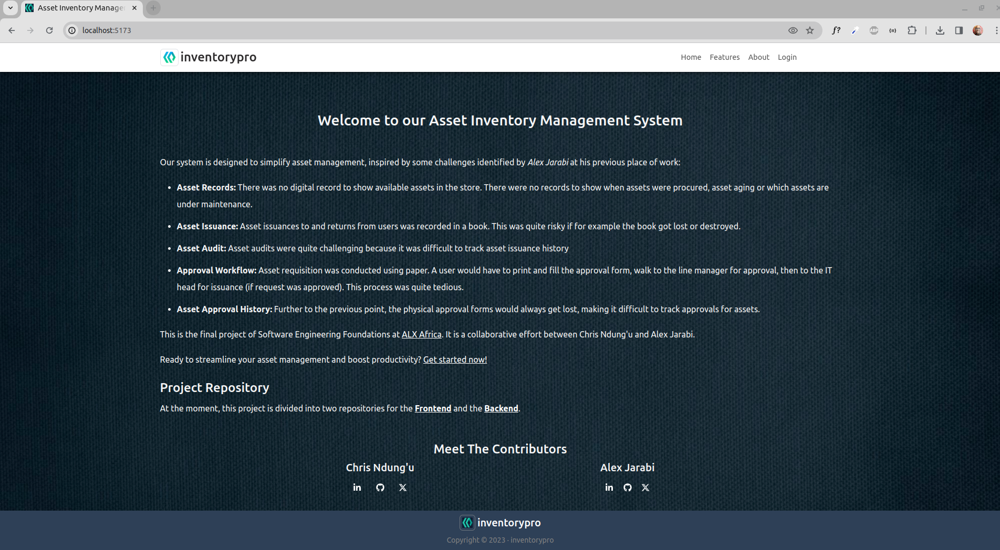

# Asset Inventory Management

## Introduction

Welcome to [inventorypro](https://aim-pro.netlify.app) inventory management software. This is a specialized tool designed to efficiently track and manage, inventory assets within a business. It's a crucial component for organizations dealing with physical goods, helping them oversee stock levels, locations, and movements of items in real-time.

You can read more on this project in this [blog post](https://jarabialex.hashnode.dev/my-first-portfolio-project-challenges). You can also watch this YouTube [presentation](https://youtu.be/Mdd2lXmmoPk)

My [LinkedIn page](https://www.linkedin.com/in/jarabialex)

## Installation:

Clone this repository

```bash
git clone https://github.com/Jarabi/aim-frontend.git
```

Install dependencies

```bash
cd aim-frontend
npm install
```

## Usage

Run the development server

```bash
npm run dev
```

follow the link provided in the terminal (`http://127.0.0.1:5173`) to view your project and edits in real time

## Contributing

Contributions to the project are welcome. please read the [guidelines](https://github.com/Jarabi/aim-frontend/blob/main/contributions.md) first.

## Related Projects

This frontend runs off a backend project built by Chris Ndung'u. [See repository](https://github.com/devKiratu/aim-backend)

The development of this project is similar to similar one I had deployed some time ago to manage assets and users for my former employer. The previous one was made using Google Apps Script and running off a Google Sheets background as a database. You can view the demo [here](https://script.google.com/macros/s/AKfycbynUtDblVK0AEN6y5cGvrJGhpBbq_QO0ReL333cF3ij/dev)

## Screenshots

### Landing Page

| Hero                                                                                            | Features                                                                                            | About                                                                                            |
| ----------------------------------------------------------------------------------------------- | --------------------------------------------------------------------------------------------------- | ------------------------------------------------------------------------------------------------ |
|  |  |  |

## Project Inspiration

This system is designed to simplify asset management, inspired by some challenges identified in my previous place of work:

- Asset Records: There was no digital record to show available assets in the store. There were no records to show when assets were procured, asset aging or which assets are under maintenance.
- Asset Issuance: Asset issuances to and returns from users was recorded in a book. This was quite risky if for example the book got lost or destroyed.
- Asset Audit: Asset audits were quite challenging because it was difficult to track asset issuance history
- Approval Workflow: Asset requisition was conducted using paper. A user would have to print and fill the approval form, walk to the line manager for approval, then to the IT head for issuance (if request was approved). This process was quite tedious.
- Asset Approval History: Further to the previous point, the physical approval forms would always get lost, making it difficult to track approvals for assets.

### Benefits

1. With this project, users can easily requision for assets and there is a streamlined workflow to the approver and the IT team.
2. There will be huge savings since users will not need to print the forms for approval
3. Efficient record storage and retrieval. It is much easire to retrieve the records for reporting and auditing
